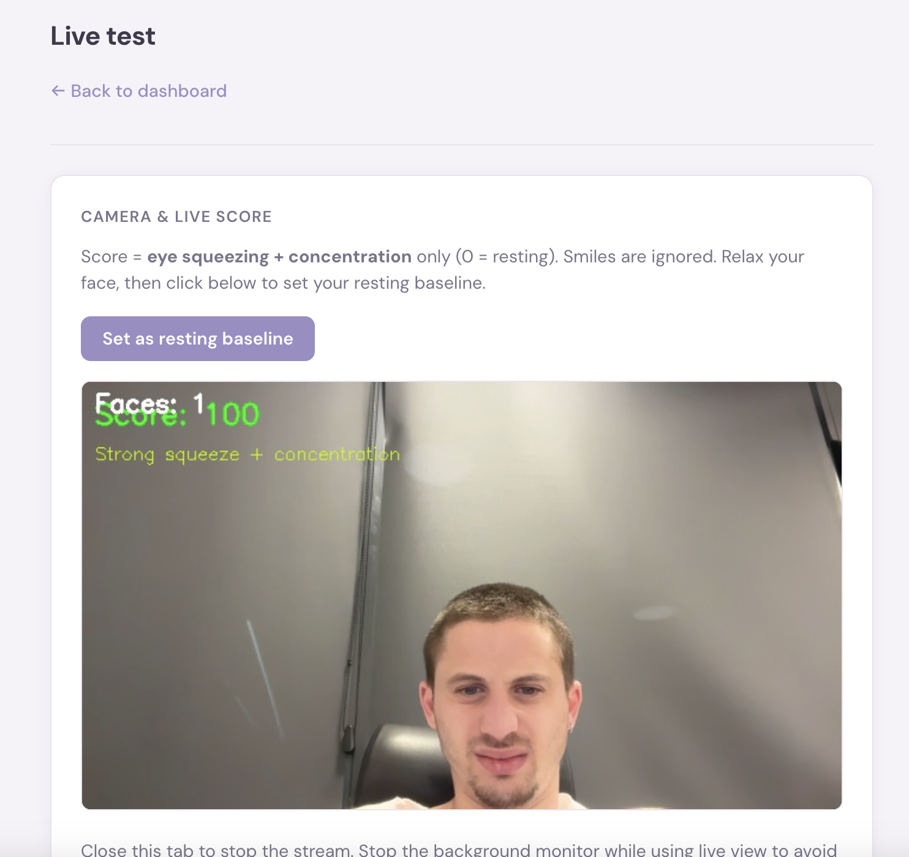

# SunSquint Guard

Lightweight macOS daemon that samples your webcam, runs on-device face detection, and scores squint (0–100). All processing is local; no images leave the machine. You set a resting-face baseline so 0 is your normal; optional notifications when the score crosses a threshold.

MIT licensed.

---

## Features

- **Local-only** — Face detection and scoring on-device; no cloud, no accounts.
- **Baseline calibration** — Resting face = 0; scores are deviation from your baseline.
- **Notifications** — Optional macOS alerts when score exceeds a threshold.
- **Dashboard** — Timeline, hourly averages, peak moments, snapshots; export as Markdown or JSON.
- **Privacy** — `SQUINT_DISCARD_IMAGES=true` to drop frames after analysis.

---

## Requirements

- macOS, Python 3.10+
- `terminal-notifier` for notifications: `brew install terminal-notifier`
- Camera permission for the process running the monitor

---

## Quick Start

```bash
git clone https://github.com/yourusername/sunsquint-guard.git
cd sunsquint-guard
python3 -m venv .venv
.venv/bin/pip install -r requirements.txt
```

First run downloads the MediaPipe Face Landmarker to `data/face_landmarker.task` (~10 MB).

**Monitor** (periodic capture, log, notify):

```bash
.venv/bin/python -m monitor
```

From project root. `Ctrl+C` to stop.

**Dashboard** (stats, export):

```bash
.venv/bin/python -m dashboard
```

Open http://127.0.0.1:5050

---

## UI

**Dashboard (`/`)** — Date picker, export, summary cards (sample count, average score, % time on screen), score-over-time and hourly-average charts, peak moments table with thumbnails, snapshots grid.


**Live (`/live`)** — Webcam stream with live score; “Set as resting baseline” to define 0.



---

## Technical Details

- **Stack:** OpenCV (capture), MediaPipe Face Landmarker (landmarks), Flask (dashboard).
- **Storage:** SQLite + log + snapshots under `data/`; model at `data/face_landmarker.task`.
- **Scoring:** Landmark-derived eye/brow geometry, 0–100 vs. saved baseline or built-in default.
- **Service:** CLI by default; optional LaunchAgent for run-at-login.

---

## Configuration

| Variable | Description | Default |
|----------|-------------|---------|
| `SQUINT_INTERVAL_MIN` / `SQUINT_INTERVAL_MAX` | Seconds between captures | 180–300 |
| `SQUINT_WARNING_THRESHOLD` | Notify when score exceeds | 70 |
| `SQUINT_SNAPSHOT_SCORE_THRESHOLD` | Save snapshot when score above | 60 |
| `SQUINT_DISCARD_IMAGES` | Drop frames after analysis | `false` |
| `SQUINT_DATA_DIR` | DB, log, snapshots, model | `./data` |
| `SQUINT_DASHBOARD_PORT` | Dashboard port | 5050 |
| `SQUINT_DASHBOARD_HOST` | Bind address | 127.0.0.1 |

---

## LaunchAgent (run at login)

```bash
./install-service.sh
```

Installs `com.sunsquintguard.monitor`, loads it. Unload:

```bash
launchctl unload ~/Library/LaunchAgents/com.sunsquintguard.monitor.plist
rm ~/Library/LaunchAgents/com.sunsquintguard.monitor.plist
```

- Status: `launchctl list | grep sunsquintguard`
- Logs: `data/squint.log`, `data/sunsquintguard-stdout.log`

Dashboard is not installed as a service; run `.venv/bin/python -m dashboard` when needed.

---

## Data & Privacy

All state under `data/` (or `SQUINT_DATA_DIR`). Set `SQUINT_DISCARD_IMAGES=true` to delete captured frames after analysis.

---

## Contributing

PRs welcome. Fork the repo, create a branch, make your changes, and open a pull request against `main`.

---

**Shay Livni** — [shaylivni.com](https://shaylivni.com)  
License: [MIT](LICENSE)
