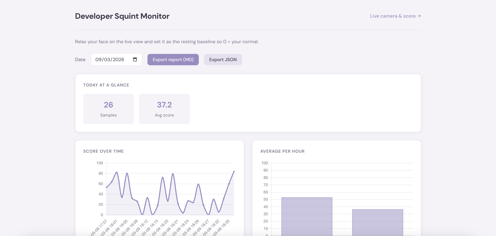
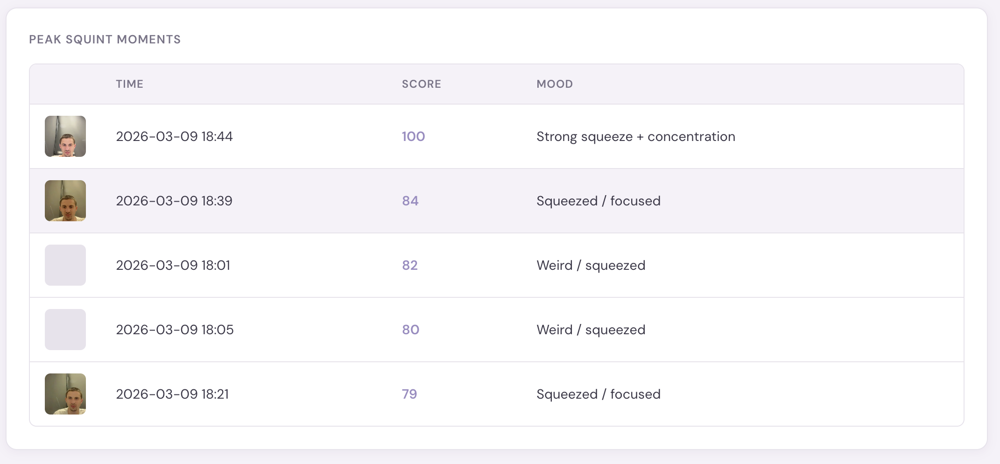
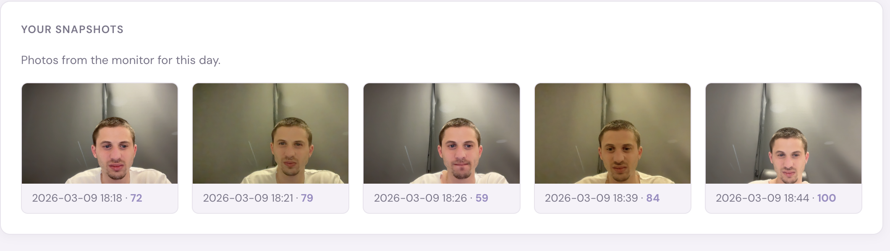

# Grump Guard

**A lightweight macOS app that watches your face and nudges you when you’re squinting at the screen.**  
Periodically captures a frame from your built-in webcam, detects your face, and scores how “squinted” your expression is (0–100). All processing runs **locally**; no images are uploaded.

**Open source** — use it for your own needs; modify and share as you like (MIT).

---

## Features

- **Local-only** — Face detection and scoring on your machine; no cloud, no accounts.
- **Calibrated to you** — Set your resting face as baseline so **0 = your normal**; scores reflect deviation from that.
- **Gentle reminders** — Optional macOS notifications when your squint score crosses a threshold.
- **Dashboard** — Timeline, hourly averages, peak moments, and snapshots; export reports as Markdown or JSON.
- **Privacy-friendly** — Option to discard captured images after analysis (`SQUINT_DISCARD_IMAGES=true`).

---

## Requirements

- **macOS**, Python 3.10+
- **terminal-notifier** for macOS notifications: `brew install terminal-notifier`
- Camera permission for the process running the monitor (Terminal or the app you launch it from)

---

## Quick start

```bash
git clone https://github.com/yourusername/grump-guard.git
cd grump-guard
python3 -m venv .venv
.venv/bin/pip install -r requirements.txt
```

On first run, the Face Landmarker model is downloaded once to `data/face_landmarker.task` (~10 MB).

**Run the background monitor** (capture every 3–5 minutes, log, notify):

```bash
.venv/bin/python -m monitor
```

Run from the project root. Press `Ctrl+C` to stop.

**Run the dashboard** (timeline, stats, export):

```bash
.venv/bin/python -m dashboard
```

Then open **http://127.0.0.1:5050** in your browser.

---

## UI at a glance

### Dashboard (`/`)

Single-page view with date picker and export buttons. Summary cards show **samples count**, **average score**, and **% time looking at screen**. Two charts: **score over time** (line) and **average per hour** (bar). A table lists **peak squint moments** with thumbnails and mood; below that, a **snapshots grid** of captured frames for the day.





### Live view (`/live`)

Camera stream with live score overlay. One button: **Set as resting baseline** — relax your face and click to define 0 for future scores. Link back to dashboard.



---

## Install as a macOS service (LaunchAgent)

Run the monitor in the background as a user service so it starts on login and survives restarts:

```bash
./install-service.sh
```

This script:

1. Resolves the project root and your venv Python.
2. Installs a LaunchAgent plist for **com.grumpguard.monitor**.
3. Loads the agent so it starts immediately.

**Uninstall:**

```bash
launchctl unload ~/Library/LaunchAgents/com.grumpguard.monitor.plist
rm ~/Library/LaunchAgents/com.grumpguard.monitor.plist
```

**Useful commands:**

- See if it’s running: `launchctl list | grep grumpguard`
- View logs: `launchctl kickstart -k gui/$(id -u)/com.grumpguard.monitor` (restart), then check `data/squint.log` or stdout/stderr in the plist if you redirect them.

The **dashboard** is not installed as a service; run it when you want to view or export data:  
`.venv/bin/python -m dashboard`

---

## Configuration

| Variable | Description | Default |
|----------|-------------|---------|
| `SQUINT_INTERVAL_MIN` / `SQUINT_INTERVAL_MAX` | Seconds between captures | 180–300 |
| `SQUINT_WARNING_THRESHOLD` | Notify when score exceeds this | 70 |
| `SQUINT_SNAPSHOT_SCORE_THRESHOLD` | Only save a snapshot when score is above this | 60 |
| `SQUINT_DISCARD_IMAGES` | Delete captured images after analysis | `false` |
| `SQUINT_DATA_DIR` | Directory for DB, log, snapshots, model | `./data` |
| `SQUINT_DASHBOARD_PORT` | Dashboard port | 5050 |
| `SQUINT_DASHBOARD_HOST` | Dashboard bind address | 127.0.0.1 |

---

## Data and privacy

- SQLite DB, log file, snapshots, and the Face Landmarker model live under `data/` (or `SQUINT_DATA_DIR`). Everything stays on your machine.
- Set `SQUINT_DISCARD_IMAGES=true` to delete captured frames after analysis and notifications.

---

## Author

**Shay Livni** — [shaylivni.com](https://shaylivni.com)

---

## License

Open source (MIT). Use it for your own needs; modify and share as you like. See [LICENSE](LICENSE) in the repo.
